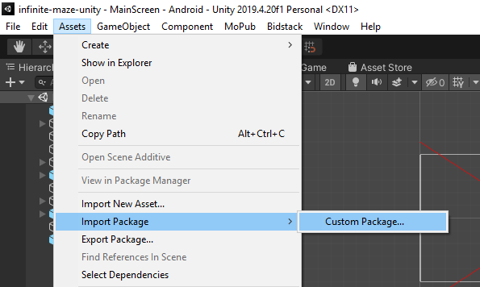
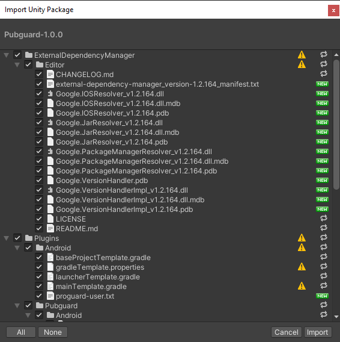
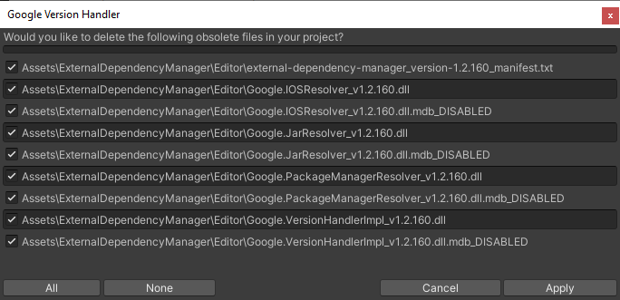
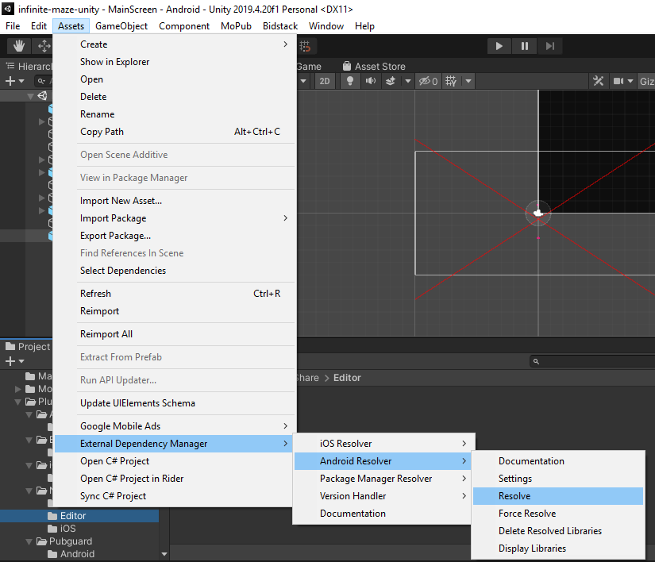
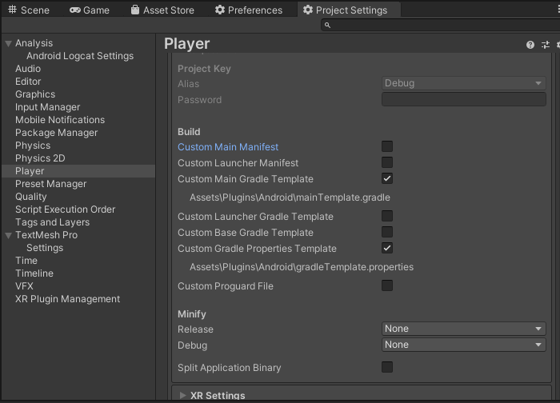
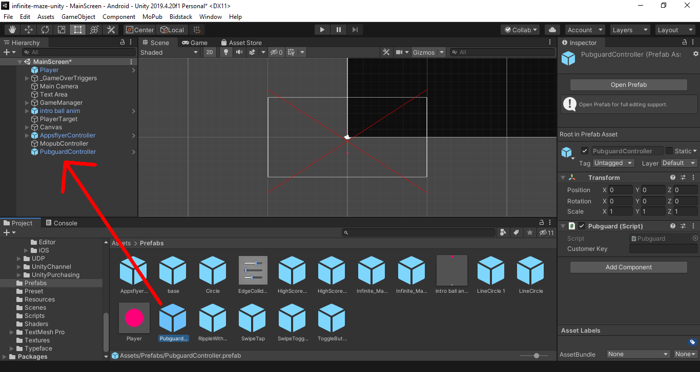
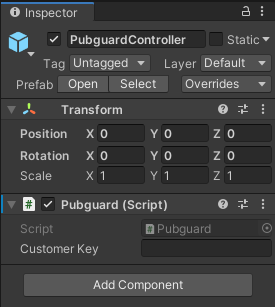

<p align="center">
  
</p>

# Pubguard Android Library

A guide to installing Pubguard on your Android application

The Pubguard Library is a solution that monitors the advertising content flowing through your mobile app, protecting against unwanted content and optimizing revenues.

The data from the library is then accessible via your account on the Pubguard interface where you can set up preferences, alerts and browse the gallery.

---

# Table of contents

<!--ts-->

- [Getting Started](#getting-started)
- [Requirements](#requirements)
- [Integrating](#integrating)
- [R8 / ProGuard](#r8--proguard)
- [Unity Plugin](#unity-plugin)
- [Change Log](#changelog)
- [Library Size](#library-size)
- [SDK support](#support)
- [Versioning](#versioning)
- [License](#license)
<!--* [FAQs](https://github.com/bidstack-group/pubguardSDK/wiki/FAQs)-->

<!--te-->

# Getting Started

These instructions will enable you to get the Pubguard library running on your Android app.  
iOS instructions can be found [here](https://github.com/bidstack-group/pubguard-sdk-ios)

## Prerequisites

Before installing the Pubguard library you will need an application key that is available from your account, to receive a key please sign up from http://dashboard.pubguard.com or email support@pubguard.com. The key is used in both the iOS and Android installations.

```
pubguardKey = "xxxxxxxxxxxxxxxxxxx"
```

---

# Requirements

- Android Studio 3.3 and up
- Android platform 4.4 KitKat (API 19) and up
- Android Gradle Plugin 3.3.0 and up
- Gradle Wrapper 5.0 and up
- (only for Unity3D) Unity3D starting from 2019.2

**Note** Android Studio 4.2 and up uses JDK 11 by default. If you need to use Android Gradle Plugin with a version lower than **3.6.0** or if you need to use Gradle with a version lower than **6.0**, make sure to use JDK 8 for the project build. To do that you can use CLI to build a project, change the JDK path in Android Studio "Project Structure" settings or you can downgrade Android Studio to the version lower than 4.2). All other Android Gradle Plugin and Gradle versions work with JDK 11.

---

# Integrating

### Installing locally

- Copy pubguard.aar and aspectj.jar into your main app module libs folder
- Into project's `build.gradle` add:

  ```groovy
  buildscript {
      repositories {
          google()
          jcenter()
      }
      dependencies {
          classpath "org.jetbrains.kotlin:kotlin-gradle-plugin:1.4.21"
          classpath files('app/libs/aspectj.jar')
          classpath "org.aspectj:aspectjtools:1.9.4"
          classpath "org.aspectj:aspectjrt:1.9.4"
          classpath "org.javassist:javassist:3.27.0-GA"
      }
  }
  allprojects {
    repositories {
        google()
        jcenter()
        flatDir {
            dirs "libs"
        }
    }
  }
  ```

- Into module's `build.gradle` add:

  ```groovy
  plugins {
    id 'com.android.application'
    id 'com.bidstack.pubguard.aspectj-ext'
  }

  android {
      compileOptions {
        sourceCompatibility JavaVersion.VERSION_1_8
        targetCompatibility JavaVersion.VERSION_1_8
    }
  }

  dependencies {

    // Pubguard
    implementation files('libs/pubguard.aar')

    // android
    implementation "androidx.core:core:1.3.1"
    implementation 'com.google.android.gms:play-services-basement:[GOOGLE_AD_VERSION]'
    implementation 'androidx.webkit:webkit:1.2.0'

    // kotlin
    implementation "androidx.core:core-ktx:1.3.1"
    implementation "org.jetbrains.kotlin:kotlin-stdlib-jdk7:$kotlin_version"
    implementation 'org.jetbrains.kotlinx:kotlinx-coroutines-core:1.3.7'
    implementation 'org.jetbrains.kotlinx:kotlinx-coroutines-android:1.3.3'

    // networking
    implementation 'com.squareup.retrofit2:retrofit:2.6.3'

    // networking  converters
    implementation 'com.squareup.retrofit2:converter-protobuf:2.6.3'
    implementation 'com.google.protobuf:protobuf-java:3.6.1'

    // other 
    implementation 'org.apache.commons:commons-text:1.9'

  }
  ```

**Note** that it is required to add `implementation 'com.google.android.gms:play-services-basement:[GOOGLE_AD_VERSION]'`
[GOOGLE_AD_VERSION] Version is based on your google ads version as per above. Even if you are not using Google ads, you still need to add support for Google services.

#### Initialising the Library

The Pubguard SDK should be initialized once at app launch. It is recommended to initialize the SDK in the Application subclass. Here's an example of how to call the init method in the Application subclass:

```java
import com.bidstack.pubguard.Pubguard;
…

public class MyApplication extends Application {

    @Override public void onCreate() {
        super.onCreate();

        try {
            Pubguard.init(application, "YOUR_PUBGUARD_KEY");
        } catch (Exception e) {
            Log.e(TAG, "Pubguard Init exception: " + e.getMessage());
        }
    }
}
```

**Note** All initialization parameters are mandatory and an exception will be thrown if null or empty string is passed.

- `application` is your apps `Application` class
- `YOUR_PUBGUARD_KEY` is a `String` of your publisher key that can be found in the Pubguard console

---

## R8 / ProGuard

If you use Pubguard as a dependency in an Android project which uses R8 as a default compiler you don’t have to do anything and you can skip this section. All rules are already bundled into AAR which can be interpreted by R8 automatically. 
However, if you don't use R8, you will need to follow the next steps:

Please keep all classes that are related to the ad network, that you use.

<details>
  <summary>Click to expand example</summary>

```
-keep class com.vungle.** {*; }
-dontwarn com.vungle.**

-keep class com.unity3d.ads.** { *; }
-dontwarn com.unity3d.ads.**

-keep class tv.teads.** { *; }
-dontwarn tv.teads.**

-keep class com.google.android.exoplayer2.** { *; }
-dontwarn com.google.android.exoplayer2.**

-keep class com.adcolony.** { *; }
-dontwarn com.adcolony.**

-keep class com.iab.omid.library.adcolony.** { *; }
-dontwarn com.iab.omid.library.adcolony.**

-keep class com.aerserv.**
-dontwarn com.aerserv.**

-keep class com.smaato.** { *; }
-dontwarn com.smaato.**

-keep class com.inmobi.** { *; }
-dontwarn com.inmobi.**

-keep class com.rfm.** { *; }
-dontwarn com.rfm.**

-keep class com.amazon.** { *; }
-dontwarn com.amazon.**

-keep class com.millennialmedia.** { *; }
-dontwarn com.millennialmedia.**

-keep class com.ironsource.** { *; }
-dontwarn com.ironsource.**

-keep class com.mopub.** { *; }
-dontwarn com.mopub.**

-keep class com.google.android.gms.** { *; }
-dontwarn com.google.android.gms.**

-keep class com.openx.** { *; }
-dontwarn com.openx.**

-keep class com.chartboost.** { *; }
-dontwarn com.chartboost.**

-keep class com.verizon.ads** { *; }
-dontwarn com.verizon.ads.**

-keep class com.smaato.sdk.** { *;}
-dontwarn com.smaato.sdk.**
```

</details>

### R8

If you are using R8 then add the following rules:

```
-keep class com.bidstack** { *; }
-dontwarn com.bidstack**
```

### ProGuard

If you are using ProGuard then add the following rules:

```
-optimizations !code/simplification/arithmetic,!code/simplification/cast,!field/*,!class/merging/*
-dontpreverify
-dontusemixedcaseclassnames
-dontskipnonpubliclibraryclasses

-dontwarn module-info

-keepclassmembers class **.R$* {
    public static <fields>;
}

-keep class com.bidstack** { *; }
-dontwarn com.bidstack**
```

Pubguard SDK uses Retrofit as a dependency, so make sure to include also Retrofit's ProGuard rules, they can be found [here](https://github.com/square/retrofit/blob/master/retrofit/src/main/resources/META-INF/proguard/retrofit2.pro).

# Unity Plugin

Open your project in the Unity editor. Select **Assets > Import Package > Custom Package** and find the Pubguard.unitypackage file you downloaded



Make sure all of the files are selected and click **Import**.



Pubguard Unity Plugin uses External Dependency Manager for Unity to resolve dependencies. If you have used External Dependency Manager before you can see an offer to delete outdated files, click **Apply**



In the Unity editor, select **Assets > External Dependency Manager > Android Resolver > Force Resolve** (If you make any changes which affect Android dependencies, then run Resolver again)



**(optionally)** It is possible to make Android Resolver work faster if **Custom Main Gradle Template** and **Custom Gradle Properties Template** are enabled



1. From **Project** tab expand **Assets > Prefabs**
2. Drag and Drop **Pubguard** prefab to the Project Hierachy list
3. The **PubguardController** shoud appear in the Hierachy list as shown on the image below



Click on the **PubguardControler** and from the Inspector tab enter the Pubguards's Application Key.<br>
Check the [Prerequisites](#Prerequisites) section explaining how to obtain the Application Key.



The Pubguard plugin installation is now completed.

#### Note

- Pubguard will be unable to initialize if the exported project is built outside of Unity (for example in Android Studio) because Pubguard uses c# script for initialization.
- If you don't see `I/PUBGUARD: Pubguard initialized successfully` in logcat after app launch, try restarting Unity (this action will clear the `Temp` folder from your project's root).

---

# Changelog

For all release notes and previous versions please see our [changelog](changelog.md).

---

# Library Size

The Pubguard team understands the importance of having a small footprint and our library is optimized to be as lightweight as possible on both iOS and Android.

Here is a guide based on our compiling with our test apps, please bear in mind the size may increase or reduce based on the number of SDKs you use and the number of shared dependencies.

<table>
  <thead>
    <tr>
      <th colspan=2>Android Native SDK</th><th>Unity Plugin</th>
    </tr>
    <tr>
      <th>Dependencies</th><th>Size</th><th>Size</th>
    </tr>
  </thead>
  <tbody>
    <tr>
      <td>Pubguard SDK</td><td align="right">~400KB</td><td rowspan=10 align="right">~14.2MB</td>
    </tr>
    <tr>
      <td>Play Services Basement</td><td align="right">~324KB</td>
    </tr>
    <tr>
      <td>Core Kotlin Extensions</td><td align="right">~159KB</td>
    </tr>
    <tr>
      <td>Kotlin Stdlib Jdk7</td><td align="right">~22KB</td>
    </tr>
    <tr>
      <td>Kotlin Coroutines Core</td><td align="right">~1,7MB</td>
    </tr>
    <tr>
      <td>Kotlin Coroutines Android</td><td align="right">~20KB</td>
    </tr>
    <tr>
      <td>Retrofit2</td><td align="right">~129KB</td>
    </tr>
    <tr>
      <td>Retrofit2 Converter Protobuf</td><td align="right">~5KB</td>
    </tr>
    <tr>
      <td>Protobuf Java</td><td align="right">~1,4MB</td>
    </tr>
    <tr>
      <td>Apache Commons Text</td><td align="right">~211KB</td>
    </tr>
    <tr>
      <td><b>Total</b></td><td align="right">~4.1MB</td>
    </tr>
  </tbody>
</table>

---

# Support

### Advertising SDK support

These are SDKs designed specifically for serving advertising content into your app, if you would like information on a version or vendor that is not on this list please email support@pubguard.com

| Company/Product           | Android SDK identifier                        | Android versions                                              |
| ------------------------- | --------------------------------------------- | ------------------------------------------------------------- |
| AdColony                  | com.adcolony:sdk                              | 4.1.0 - 4.3.0                                                 |
| AdMob                     | com.google.android.gms:play-services-ads      | 19.0.0 - 19.8.0                                               |
| Amazon Mobile Ads         | com.amazon.android:mobile-ads                 | 6.0.0                                                         |
| AppLovin                  | com.applovin:applovin-sdk                     | 9.14.4 - 9.14.5                                               |
| Chartboost                | com.chartboost:chartboost-sdk                 | 7.5.0;<br/> 8.1.0 - 8.2.0                                     |
| Fyber FairBir             | com.fyber:fairbid-sdk                         | 3.6.0 - 3.7.0                                                 |
| Fyber Marketplace         | com.fyber.vamp:core-sdk/:video-kit/:mraid-kit | 7.7.2                                                         |
| InMobi                    | com.inmobi.monetization:inmobi-ads            | 9.0.1;<br/> 9.1.0                                             |
| ironSource                | com.ironsource.sdk:mediationsdk               | 6.14.0.1;<br/>6.16.1;<br/> 6.18.0 - 7.0.3;<br/>7.1.1 - 7.1.5.1;<br> |
| MoPub                     | com.mopub:mopub-sdk                           | 5.14.0                                                        |
| Smaato                    | com.smaato.android.sdk:smaato-sdk             | 21.5.3 - 21.5.4                                               |
| Unity Ads                 | com.unity3d.ads:unity-ads                     | 3.4.2 - 3.5.0; 3.6.0                                          |
| Verizon                   | com.verizon.ads:android-vas-standard-edition  | 1.2.0; 1.8.0 - 1.8.2                                          |
| Vungle                    | com.vungle:publisher-sdk-android              | 6.7.1 - 6.8.1                                                 |

---

# Versioning

Please use the most up to date version at all times to ensure maximum support.

---

# License

_© 2019 Minimised Media Limited (Pubguard© 2019 All Rights Reserved)_
